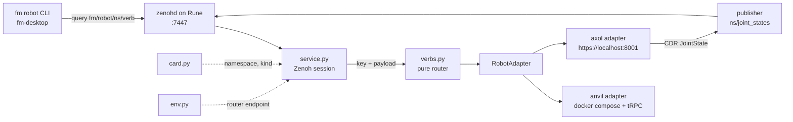

# fm_robot_agent

The agent process: one Zenoh queryable, one adapter, one robot.

## Why

A robot's own stack cannot answer for itself. The configuration it reads is
rewritten from outside, the containers it runs in are restarted from outside, and
the episode files it writes are counted from outside. This agent is that outside,
running on the robot's host under systemd, reachable only through the fleet
router.

## How It Fits Together



## Config And Its Guards

```
config get   ──▶ every key the robot holds, each with its class
config set   ──▶ severing  write · restart stack + bridge · watch telemetry · revert if dead
                 motion    refused unless the robot reports itself idle
                 tuning    written through
                 mode      validated against what the robot offers
                 unknown   refused; an unclassified key is never written
config rollback ─▶ undo the open severing change
```

A severing change is verified against the **fabric**, not against the robot's own
container. A container's DDS graph is healthy whatever interface the bridge was
pointed at, so asking it cannot fail for the defect this class exists to catch —
pointed at `docker0` on the workcell, that question reported telemetry returning
while the fleet received nothing. The service subscribes to this robot's
`joint_states` key from the session it already holds and hands the adapter a
probe; the adapter still imports no Zenoh, and the suite still runs with no
router. A bench run with no session falls back to the container, where there is
no fabric to be wrong about.

The restart is waited on rather than detached, which is the other half of the
same lesson: a detached recreate returns while the old containers are still
publishing the old, working configuration, so the window opens against telemetry
the change has not reached yet and every value verifies. A nonexistent interface
passed in five seconds that way, and the journal closed before the containers it
broke had restarted.

A severing change is journalled to disk before anything is written and the
journal is closed only once telemetry has been seen. An agent that starts and
finds one open is an agent whose predecessor died inside the verification window,
so `service.py` finishes the rollback it inherited before answering anything.

On the Anvil the domain and the interface live in two files — the loader's
`.env.config` and `/etc/fm-comms.env` — and a write lands in both or in neither.
Writing one and not the other is exactly the silent defect the 2026-09-01
hardware run found twice.

Only `service.py` imports Zenoh. Everything the suite exercises — the router, the
adapters, the card and env readers — runs with no session, no router, and no
robot.

## Modules

| Module | Holds |
| --- | --- |
| `protocol.py` | `RobotAdapter`, `Outcome`, the schema version every reply carries |
| `config.py` | what a configuration key is: its class, its journal, env-file reads and writes |
| `verbs.py` | key → adapter call → reply, as one pure function |
| `card.py` | this host's identity card: name, namespace, robot kind |
| `env.py` | the router endpoint, from the environment or `/etc/fm-comms.env` |
| `anvil.py` | the Anvil workcell: compose, the webapp's tRPC lane, ros2 services |
| `trpc.py` | the webapp's tRPC-over-WebSocket protocol, the two call shapes |
| `axol.py` | the Almond Axol: its HTTPS server, and its telemetry as JointState |
| `cdr.py` | CDR encoding, so an Axol reaches the fabric looking like a ROS rig |
| `fake.py` | a robot that exists only in memory, for the suite and `--fake` |
| `service.py` | the Zenoh session, the queryable, and the fabric watch a severing write is verified against |
| `client.py` | `fm robot`: a device name and a verb become one query |

## Use

```bash
uv run fm-robot-agent            # read this host's card, serve its robot
uv run fm-robot-agent --fake     # a robot in memory, for a bench run
uv run fm-robot list             # ask the fabric which robots are up
```

## Test

```bash
uv run --extra dev pytest
```
