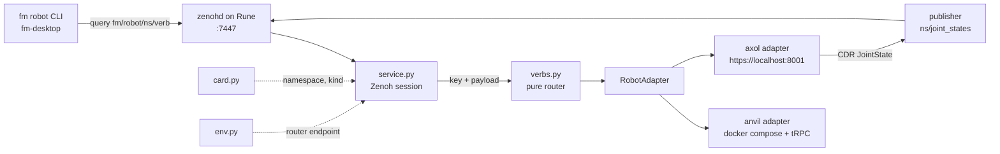

# fm_robot_agent

The agent process: one Zenoh queryable, one adapter, one robot.

## Why

A robot's own stack cannot answer for itself. The mode config it reads is
rewritten from outside, the containers it runs in are restarted from outside, and
the episode files it writes are counted from outside. This agent is that outside,
running on the robot's host under systemd, reachable only through the fleet
router.

## How It Fits Together



Only `service.py` imports Zenoh. Everything the suite exercises — the router, the
adapters, the card and env readers — runs with no session, no router, and no
robot.

## Modules

| Module | Holds |
| --- | --- |
| `protocol.py` | `RobotAdapter`, `Outcome`, the schema version every reply carries |
| `verbs.py` | key → adapter call → reply, as one pure function |
| `card.py` | this host's identity card: name, namespace, robot kind |
| `env.py` | the router endpoint, from the environment or `/etc/fm-comms.env` |
| `anvil.py` | the Anvil workcell: compose, the webapp's tRPC lane, ros2 services |
| `trpc.py` | the webapp's tRPC-over-WebSocket protocol, the two call shapes |
| `axol.py` | the Almond Axol: its HTTPS server, and its telemetry as JointState |
| `cdr.py` | CDR encoding, so an Axol reaches the fabric looking like a ROS rig |
| `fake.py` | a robot that exists only in memory, for the suite and `--fake` |
| `service.py` | the Zenoh session and the queryable, and nothing else |
| `client.py` | `fm robot`: a device name and a verb become one query |

## Use

```bash
uv run fm-robot-agent            # read this host's card, serve its robot
uv run fm-robot-agent --fake     # a robot in memory, for a bench run
uv run fm-robot list             # ask the fabric which robots are up
```

## Test

```bash
uv run --extra dev pytest
```
